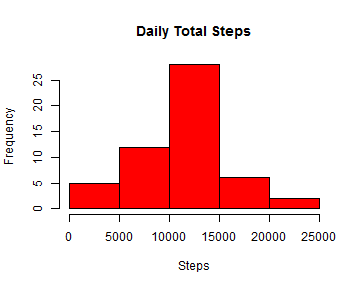
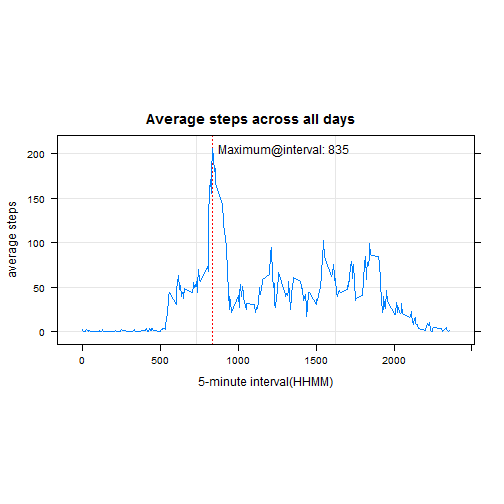
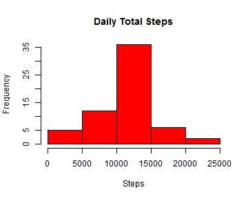
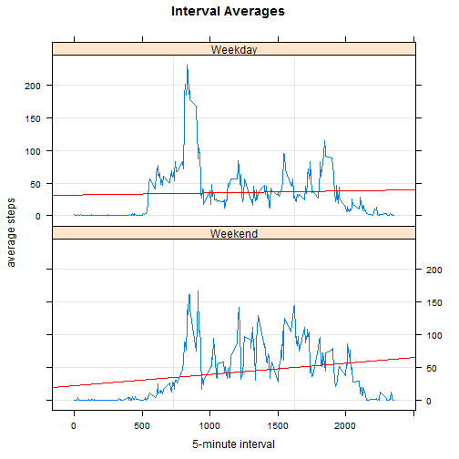

# Reproducible Research: Peer Assessment 1

#### Dataset and download instruction. 
1. Download [Activity Monitoring Data](https://d396qusza40orc.cloudfront.net/repdata%2Fdata%2Factivity.zip)  
2. Refer assignment readme.MD for a description of the dataset.
3. The code provided here expects the dataset to be downloaded and extracted 
to the local working directory of R

#### R Versions and Packages used  
* R version 3.1.2
* RStudio - Version 0.98.1102
* Knitr and realted packages
* dplyr, lattice for data processing and plotting

---

## Loading and preprocessing the data

The dataset is a comma separated text file. We may proceed with reading and preprocessing using code below.


```r
#read file from working directory
act <- read.csv("activity.csv", header=TRUE)

#date read as factor by default. Convert to date class for easier handling 
act <- within(act, 
              date <- as.Date(as.character(date), format = "%Y-%m-%d"))

str(act)  # study number of observations and variables are as specified  
```

```
## 'data.frame':	17568 obs. of  3 variables:
##  $ steps   : int  NA NA NA NA NA NA NA NA NA NA ...
##  $ date    : Date, format: "2012-10-01" "2012-10-01" ...
##  $ interval: int  0 5 10 15 20 25 30 35 40 45 ...
```

Next we study the data to observe for duplicates, missing records and so on. 

Considering the data is for the month of Oct and Nov, we expect no duplicates if there are  61 different dates with 288 different 5-minute time intervals for each day. Code below helps with some of these checks.


```r
startDate <- min(act$date)
endDate <- max(act$date)
numdays <- length(unique(act$date))

allint <- all(table(act$date) == 288)  # Should Return TRUE for our dataset

# (optional) add check to see if there is interval duplication during day
```

Dataset contains observations from **2012-10-01** to **2012-11-30** for **61** days.  
A test to check if dataset has 288 records per day (5-min intervals) returned  **TRUE**  
 
Dataset has missing records as per instructions. We look into it later when answering the questions. Continuing into analysis... 

---

## What is mean total number of steps taken per day?

First we calculate total steps per day. `dplyr` package is used for convenience.


```r
options(scipen=999) #turning off knitr scientific notation for output

library(dplyr)    #using dplyr package 
act.sub <- act[which(!is.na(act$steps)),]  #remove rows with NA
act.sum <- tbl_df(act.sub) %>%
                  group_by(date) %>% 
                        summarise(day.total = sum(steps))

#calculate mean and median of totals. Used later to report using inline markdown
total.mean <- round(mean(act.sum$day.total),0)
total.median <- round(median(act.sum$day.total),0)
```

Histogram plot of total steps using the summary dataset created above.  


```r
hist(act.sum$day.total, col="red",
            xlab="Steps", main="Daily Total Steps")
```

 

As can be seen, the distribution is close to Normal and gives a rough indication of mean and median total steps. One could expect most days to clock 10000 to 15000 steps in total. Calculated mean and median are reported below.

**Mean of total steps = 10766**    
**Median of total steps = 10765**  

---

## What is the average daily activity pattern?

We continue to use the *dplyr* package and this time group on `interval` field. The data for each interval is averaged across all days and a time series plot is created using lattice package.

Note, we could convert the interval to proper time but since it wouldn't have any visible impact on the activity pattern, it is not attempted here.


```r
act.tbldf <- tbl_df(act)  # create dplyr df_tbl from act dataset 

act.all.avg <- act.tbldf %>%
      group_by(interval) %>%  
      summarise( 
            int.avg = round(mean(steps, na.rm=TRUE),0)  #missing values removed
      )

#create time-series plot
library(lattice)  # using lattice plot system to create xyplot
xyplot(int.avg~interval, data=act.all.avg , aspect=0.5,
       main="Average steps across all days", 
       ylab="average steps", xlab="5-minute interval(HHMM)",
       scales=list(x=list(relation="free")),
       panel=function(x,y) {
             panel.grid(h=-1,v=2)
             xt <- x[which(y==max(y))]  # time interval when average is max
             panel.abline( v=xt, lty = "dotted", col = "red") #draw vertical line at peak
             panel.text(x[which(y==max(y))],max(y),labels= paste0("Maximum@interval: ",xt),
                        pos=4) # position label on right side
             panel.xyplot(x,y, type="l")
             par.strip.text=list(cex=0.8)
       }, as.table = T)
```

 


```r
#calculate 5-min max from processed data and display using inline markdown
maxfivemin <- act.all.avg[which(act.all.avg$int.avg==max(act.all.avg$int.avg)),]
```

The maximum steps for the 5-minute average occurs at interval **835**  with an average value of **206**  

---

## Imputing missing values

#### Finding missing values  
Only `steps` variable have missing values. Code below computes the number of 
rows with missing values.  


```r
na.rows <- which(is.na(act$steps)==TRUE)
na.rowcount <- length(na.rows)  #num rows with NA's
```

**2304** rows found with missing values (`NA`s)   

#### Replacing missing values in new copy of the original dataset 
Simple strategy adopted - use the interval average across all days for any of the missing values. 


```r
act.new <- act   # new dataset for updating missing values

#update missing values
act.new[na.rows,]$steps <- act.all.avg$int.avg[
      match(act.new[na.rows,]$interval,act.all.avg$interval)]

any(is.na(act.new$steps)) # check if any 'NA's still
```

**act.new** is now new dataset with no missing values

#### Calculating mean, median of totals with new dataset


```r
options(scipen=999) #turning off knitr scientific notation for output

act.new.sum <- tbl_df(act.new) %>%
                  group_by(date) %>% 
                        summarise(day.total = sum(steps))

#calculate mean and median of totals. Used later to report using inline markdown
total.mean.new <- round(mean(act.new.sum$day.total),0)
total.median.new <- round(median(act.new.sum$day.total),0)
```

Histogram plot of total steps using the summary dataset created above.  


```r
hist(act.new.sum$day.total, col="red",
            xlab="Steps", main="Daily Total Steps")
```

 

As can be seen and as expected, the imputation resulted in a higher frequency around the mean/median .

Calculated mean and median for new dataset are reported below.

**Mean of total steps = 10766**  
**Median of total steps = 10762**   

---
## Are there differences in activity patterns between weekdays and weekends?

First we create an additional variable *weekday* and add to new dataset .


```r
# add new weekday variable to act.new
wkend <- c("Saturday","Sunday")
act.new <- within(act.new, weekday <- as.factor(ifelse(weekdays(date) %in% wkend,
                                         "Weekend","Weekday"))) 
```

The interval averages are now computed after grouping on both weekday and interval variables.  A time series plot is created using lattice to observe any difference in patterns.  A linear fit is attempted as well to observe any trends in activity during the course of the day.    


```r
act.tbldf <- tbl_df(act.new)  # create dplyr df_tbl from act dataset 
act.wkday.avg <- act.tbldf %>%   # reusing act.tbldf created in prev Q
      group_by(weekday, interval) %>%  # 
      summarise( 
            int.wkday.avg = round(mean(steps, na.rm=TRUE),0)
      )

xyplot(int.wkday.avg~interval | weekday, data=act.wkday.avg ,  
       layout=c(1,2),main="Interval Averages", 
       ylab="average steps", xlab="5-minute interval",
       panel=function(x,y) {
             panel.grid(h=-1,v=2)
             panel.xyplot(x,y, type="l")
             panel.lmline(x,y, lty=1, col="red")
             par.strip.text=list(cex=0.8)
       }, as.table = T)
```

 

As can be seen there is greater activity during weekends. In addition, the activity shows in increase as the day progresses during weekends whereas it is more or less steady during weekdays.
